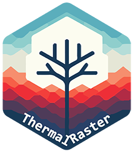
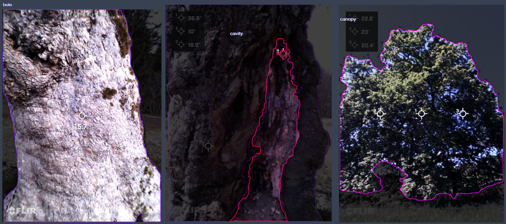
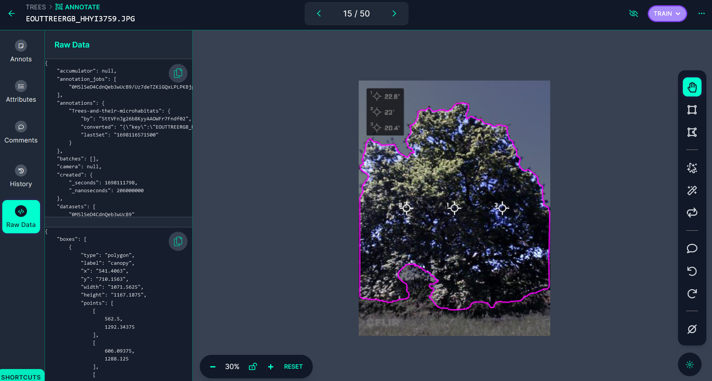

```{r setup, include=FALSE}
knitr::opts_chunk$set(echo = TRUE)
```

# ThermalRaster



## Table of Contents

```{r generate-toc, echo=FALSE}

source("https://gist.githubusercontent.com/gadenbuie/c83e078bf8c81b035e32c3fc0cf04ee8/raw/26e78c78a7a9d096d695c708e8a45830a1d1121a/render_toc.R")

render_toc("README.Rmd")

```

## Package description

**ThermalRaster** package is designed to enhance the processing and analysis of FLIR thermal and RGB images. It offers a comprehensive suite of functions for extracting, processing, and visualizing **thermal data** embedded within the metadata of FLIR images. Key features also include retrieving full and cropped **RGB images**. Imagery is returned as **`SpatRaster`** objects compatible with the **`terra`** package, enabling to profit from this package features/toolkit.

Using the overlap between low-resolution thermal imagery with high-resolution RGB images, the package enables the creation of synthetic or predicted thermal images for either cropped or full RGB images. This is achieved through the application of the Random Forest algorithm (via the **`ranger`** package) or Deep Learning methodologies (utilizing **`keras`**/**`tensorflow`**).

The package also enables the handling of JSON annotations/masks from Roboflow (<https://roboflow.com>), enabling the extraction of ROIs from the images for further analysis, making possible to assess, plot, analyze and model fine-scale thermal variation in micro-habitats (i.e., TReMs - Tree Related Micro-habitats). Roboflow's advantages include improved ROI digitization using manual or the SAM (Facebook's Segment Anything) algorithm. ROIs can also be generated with the terra package as **`SpatVector`** objects.

EXIFtool ([https://exiftool.org/](https://roboflow.com)) is broadly used for retrieving metadata from FLIR imagery and the **`ThermImage`** package to convert from raw to temperature.

------------------------------------------------------------------------

Here we will show some examples of processing FLIR ONE Edge Pro imagery that are provided as samples in the package:

## Working with RGB imagery

```{r load-packages-data, message=FALSE, warning=FALSE}

library(ThermalRaster)
library(terra)
library(dplyr)
library(ggplot2)

# Image path in sample data
image_path <- system.file("extdata", "BEECH1_EINBRGB_IPUQ4327.JPG", package = "ThermalRaster")

# Provide here the folder path where the EXIFtool executale is
# NOTE: The executable must be named exiftool
exiftool_path = "C:/MyFiles/R-dev/Giant_Trees"

```

Plot the FLIR image thumbnail as it is captured by the FLIR camera:

```{r plot-thumnail-img}

thumb <- flir_thumbnail_to_rast(image_path)

plotRGB(thumb)

```

Now let's check the full RGB image that is contained in FLIR's metadata:

```{r plot-full-rgb}

rgb_hr <- flir_rgb_to_rast(image_path, exiftool_path, crop = FALSE)

print(rgb_hr)

plotRGB(rgb_hr, main = "Full RGB (1440x1080")

```

And now the cropped RGB which matches the size and resolution of thermal image (i.e., 640x480):

```{r plot-crop-rgb}

rgb_lr <- flir_rgb_to_rast(image_path, exiftool_path, crop = TRUE)

plotRGB(rgb_lr, main = "Cropped RGB (640x480)")

```

We can see that the second image is narrower and closer to the tree trunk (focus target).

## Working with thermal data

Start by extracting the thermal data (in degrees Celsius):

```{r raw-to-thermal-print}

temp <- flir_raw_to_thermal(image_path, exiftool_path)

print(temp)

summary(temp)


par(mfrow=c(1, 2))
plot_temp_rast(temp, palette = "magma", main = "Thermal cropped")
plotRGB(rgb_lr, main = "RGB cropped")


```

Now let's remove outliers in the thermal image that seem to more frequently occur for the lower portion of the temperature distribution values and plot again.

We will convert values lower than the 3.5% percentile to `NA` and keep all the remaining values of the upper part of the distribution unchanged.

```{r thermal-rm-outliers-plot}

temp_out_rm <- remove_outliers(temp, pmin = 3.5, pmax = 100)

plot_temp_rast(temp_out_rm, palette = "magma")

```

By removing outliers temperature gradients in the tree surface and micro-habitats such as cavities are highlighted.

Let's test different color palette to plot the image:

```{r plot-spectral-palette}

plot_temp_rast(temp_out_rm, palette="Spectral")

```

## Generating synthetic or predicted thermal images

The `ThermalRaster` package currently provides methods to generate **synthetic or predicted thermal data**. This enables to gain more detail into the fine-scale variation of surface temperature for inspecting/visualizing certain structures and/or micro-habitats.

To achieve this, we use the overlap between the "low-resolution" thermal imagery — i.e., as the target or response variable — with the "high-resolution" RGB cropped image — i.e., as the predictors or features, mainly based on color and texture — to train a Random Forest or Deep Learning model.

Because generalization across images is highly "challenging", to implement these methods we need to train the model every time. This also means different levels of performance or success depending on the objects depicted in the images.

After training, the model can be applied onto the images used for training — i.e., the "low-resolution" or cropped RGB images — and also the full size RGB image (both extracted from the FLIR's metadata using the `ThermalRaster` package).

Keep in mind that synthetic/predicted thermal data for the full size RGB has limitations since the train region does not include certain parts, objects or features in this bigger image.

```{r run-rf-model}

rf_sup_res <- rf_thermal_from_rgb(
             rgb_rst = rgb_lr,      # The predictors from cropped/low-res RGB
             temp_rst = temp,       # The target thermal image
             rgb_high_res = rgb_hr, # The full RGB image
             npix = 30000,          # Number of sample pixels used for training
             rm_cor = FALSE,        # Remove predictors through correlation
             rm_cor_thresh = 0.98,  # Correlation threshold; used if rm_cor = TRUE
             get_rf_model = TRUE,   # Get the RF model in the output object
             verbose = TRUE,        # Print progress messages?
             scale_data = FALSE)    # Scale the data before model training?

```

Let's check the RF model output:

```{r print-rf-model}

print(rf_sup_res$rf_mod)

```

Now, let's plot the predicted image considering the train/cropped RGB (with outliers removed: \< 3.5% percentile):

```{r plot-train-pred-rf}

pred_term_train_outlrm <- remove_outliers(rf_sup_res$pred_temp_train, pmin = 3.5)

par(mfrow=c(1, 3))

plotRGB(rgb_lr, main="Cropped RGB image")

plot_temp_rast(temp_out_rm, palette="magma", main="Thermal train data")

plot_temp_rast(pred_term_train_outlrm, palette = "magma", main="Synthetic/predicted thermal")

```

And now, using the full RGB to generate the "synthetic"/predicted thermal image (also w/ outliers removed):

```{r plot-full-rgb-pred-rf}

# Remove outliers
pred_term_full_outlrm <- remove_outliers(rf_sup_res$pred_temp_rgb_hr, pmin = 7.5)

par(mfrow=c(1, 2))

plotRGB(rgb_hr, main="Full RGB image")

plot_temp_rast(pred_term_full_outlrm, palette = "magma", main="Synthetic/predicted thermal")

```

Notice how the RF model can reasonably predict the temperature of pixels fully outside of the training sample/conditions!

------------------------------------------------------------------------

## Working with regions-of-interest ROIs

Regions of Interest (ROIs) — i.e., a subset of the image such as a rectangle or an irregular polygon/shape — are crucial in image analysis for focusing the analysis on specific parts of an image while excluding irrelevant areas. Basically there are two ways to make or delineate ROIs to use with `ThermalRaster`. The first one is to employ the `draw` function from the `terra` package and, the second is to use Roboflow online annotation tool (<https://roboflow.com/>). While the first is easier to set up and use, the second is much more powerful (involving semi-automated with state-of-the-art algorithms or manual digitization) especially for irregular or complex shapes; however, the latter involves sharing your image data (part of it at least) and learning how to deploy it.

Both methods are explained below in detail.

### Drawing ROIs with the terra package

The objective of this demo is to check the distribution of temperature values between different micro-habitats in the tree bole (the bark and one cavity). To do this we will draw a ROI geometry for each.

To draw an ROI we will use the `draw` function from the `terra` package. This function allows drawing on a plot to get a `SpatVector` (points, lines or polygons) or `SpatExtent` object for later use. After calling the function, start clicking on the cropped RGB image (since this one overlaps with thermal, i.e. same number of columns/rows) to draw the selected geometry. When you are done, press ESC or select "Stop". You can also preset the maximum number of clicks.

Let's start by loading the train image:

```{r get-oak-sample-data}
# Image path in sample data
querc_image_path <- system.file("extdata", "QUEROB1_EINBRGB_BWWG4662.JPG", package = "ThermalRaster")

querc_rgb <- flir_rgb_to_rast(querc_image_path, exiftool_path, crop=TRUE)

querc_temp <- flir_raw_to_thermal(querc_image_path, exiftool_path)
names(querc_temp) <- "temp_c"

par(mfrow=c(1, 2))
plotRGB(querc_rgb, main="RGB cropped")
plot_temp_rast(querc_temp, palette = "magma", main="Thermal - oak tree")

```

Start a new plotting device (useful to avoid issues with `draw` when using RStudio) and then draw the ROI. The vertices coordinates will be saved in each object.

Because the drawing is interactive, for the purpose of this explanation we will use a cached version of the ROIs stored in a GeoJSON file previously generated and available in the sample data for `ThermalRaster` package.

```{r make_roi, eval=FALSE}

# Start a new plotting device without RStudio graphics device
dev.new(noRStudioGD = TRUE)

# Plot the RGB image, in this case the cropped one which matches the thermal image
plotRGB(querc_rgb)

# Draw polygons and attribute a type
bole_s1 <- draw("polygon", id = FALSE, xpd = FALSE, col = "red")
bole_s1$type <- "bark"

bole_s2 <- draw("polygon", id = FALSE, xpd = FALSE, col = "blue")
bole_s2$type <- "cavity"

# Join the polygon ROIs
tree_samps <- bole_s1 + bole_s2

#(Write data to later reuse)
# writeVector(tree_samps, filename = "./inst/extdata/QUEROB1_EINBRGB_BWWG4662_ROIs_bole.json",
#             overwrite = TRUE)

```

Now let's compare the distribution of temperature values for the bark and the cavity for an oak tree:

```{r analyze-oak-sample-data}

geojson_file <- system.file("extdata", "QUEROB1_EINBRGB_BWWG4662_ROIs_bole.json", 
                            package = "ThermalRaster")

tree_samps <- vect(geojson_file)
crs(tree_samps) <- NA

par(mfrow=c(1,2))

plotRGB(querc_rgb)
plot(tree_samps, col=c("red","blue"), legend=TRUE, alpha=0.3, add=TRUE)
legend("topleft", legend = tree_samps$type, pch = 20, xpd=NA, bg="white", 
       col=c("red","blue"))

plot_temp_rast(querc_temp, palette = "magma", main="Thermal")
plot(tree_samps, add=TRUE)

# Create a dataframe with the polygon sequential ID and its type
tree_samps_df <- data.frame(ID = 1:length(tree_samps), 
                            type = tree_samps$type)

# Extract the values for each ROI and then 
# Join the temp values with its type using 
ext_values <- extract(querc_temp, tree_samps) %>% 
  left_join(tree_samps_df, by="ID")


ext_values %>% 
  na.omit %>% 
  group_by(`type`) %>% 
  summarise(mean = median(temp_c), std=sd(temp_c)) %>% 
  knitr::kable(digits=2, col.names=c("Type","Mean","Std.-dev."),
               caption="Average and std-deviation of temperature values (deg.C)")


```

Now let's use a different image, this time for a beech tree:

```{r analyze-beech-data, message=FALSE, warning=FALSE}

beech_image_path <- system.file("extdata", "BEECH1_EOUTTREERGB_ILAC9031.JPG", package = "ThermalRaster")


beech_rgb <- flir_rgb_to_rast(beech_image_path, exiftool_path, crop=TRUE)

beech_temp <- flir_raw_to_thermal(beech_image_path, exiftool_path)
names(beech_temp) <- "temp_c"

beech_geojson_file <- system.file("extdata", "BEECH1_EOUTTREERGB_ILAC9031_ROIs_bole.json", 
                            package = "ThermalRaster")
beech_tree_samps <- vect(beech_geojson_file)
crs(beech_tree_samps) <- NA

par(mfrow=c(1,2))

plotRGB(beech_rgb)
plot(beech_tree_samps, col=c("red","blue"), legend=TRUE, alpha=0.3, add=TRUE)
legend("topleft", legend = beech_tree_samps$type, pch = 20, xpd=NA, bg="white", 
       col=c("red","blue"))

plot_temp_rast(beech_temp, palette = "magma", main="Thermal")
plot(beech_tree_samps, add=TRUE)

# Create a dataframe with the polygon sequential ID and its type
tree_samps_df <- data.frame(ID = 1:length(beech_tree_samps), 
                            type = beech_tree_samps$type)

# Extract the values for each ROI and then 
# Join the temp values with its type using 
beech_ext_values <- extract(beech_temp, beech_tree_samps) %>% 
  left_join(tree_samps_df, by="ID")

# Summarise values
beech_ext_values %>% 
  na.omit %>% 
  group_by(`type`) %>% 
  summarise(mean = median(temp_c), std=sd(temp_c)) %>% 
  knitr::kable(digits=2, col.names=c("Type","Mean","Std.-dev."),
               caption="Average and std-deviation of temperature values (deg.C)")

```

Now, let's make a plot comparing the distributions of the two micro-habitats - check for potential multimodality and differences on the medians:

```{r}

g1 <- ggplot(ext_values, aes(x=temp_c, fill=type)) + 
      geom_density(alpha=0.5) + 
      xlab(expression("Temperature " ( degree*C))) +
      ylab("Density") + 
      theme_bw() + 
      labs(title = "Oak") + 
      theme(text=element_text(size=16))

plot(g1)

```

The same plot but this time for the beech:

```{r}

g2 <- ggplot(beech_ext_values, aes(x=temp_c, fill=type)) + 
      geom_density(alpha=0.5) + 
      labs(title = "Beech") + 
      xlab(expression("Temperature " ( degree*C))) + 
      ylab("Density") + 
      theme_bw() + 
      theme(text=element_text(size=16))

plot(g2)

```

------------------------------------------------------------------------

### Drawing ROIs with Roboflow app

Roboflow is a development platform that simplifies the process of building and deploying computer vision models. It offers a range of tools designed to assist developers in preparing, creating, and managing data sets needed for training machine learning models, with a particular emphasis on image recognition tasks.

In this context we will use Roboflow to generate ROI's of micro-habitats to showcase their thermal variability. A tutorial/vignette on how to create ROI masks with Roboflow is provided in this [link](vignettes/Protocol_for_annotating_thermal_images_using_Roboflow_app.pdf).



In a nutshell, there are two main ways of making ROI's in Roboflow:

-   “**Smart Polygon**” – This is a semi-automatic tool based on SAM (Facebook's Segment Anything Model) which can retrieve object boundaries easily, sometimes with a single click. Use one click to add one point inside the area you want to be on the polygon mask. If new points are added within the initial area, that area will be removed. Conversely, if a point is placed outside the existing area, the algorithm will try to expand the object the best way possible by context, spectral and textural similarity.

    

-   Another available option is the fully manual “**Polygon Tool**”, which gives complete control to the user for drawing a polygon to delineate the mask.

    

[**Note**]{.underline}: polygons cannot have “holes” or “islands”. This set of tools for annotation in Roboflow app cannot handle such representations.

Roboflow annotations are recorded into a specific JSON format. `ThermalRaster` can use these data stored as JSON files and convert them into spatial objects (i.e., `SpatVector`) compatible with raster data from the `terra` package. This enables the use of terra's `extract` function to get the pixel values inside the ROI and analyze them further.



```{r get-sample-roboflow-roi-masks-json, message=FALSE, warning=FALSE}

# Roboflow sample data
robo_rois_path <- system.file("extdata", "EINBRGB_IPUQ4327.json", 
                          package = "ThermalRaster")


# JSON data loaded from a Roboflow json file
json <- jsonlite::fromJSON(robo_rois_path)

print(json$boxes[,1:6])

```

To convert Roboflow annotations into `SpatVector` polygons usable with `ThermalRaster` is simple. In this example, the ROIs were collected in Roboflow from FLIR's thumbnail image — which has a size of 1440 x 1080 pixels — however, we want to convert those annotations into the dimensions of the thermal image (which is 640 x 480) hence with a scale factor of 2.25 (i.e., f = 1440 / 640). In the first step (`get_roboflow_masks)` we generate all the masks from the JSON file and, in the second step `simplify_roboflow_masks`, we aggregate/simplify the masks by label/category.

```{r make-roboflow-roi-masks}

# Make ROI masks from a json file generated in Roboflow app
robo_masks <- get_roboflow_masks(path = robo_rois_path, 
                                 rst_height = 640, 
                                 rst_width = 480,
                                 geom_rescale = 2.25)

# Simplify or aggregate the ROI masks if these are for the same category/label 
robo_masks_simple <- simplify_roboflow_masks(robo_masks)

print(robo_masks_simple)
```

[**Note**]{.underline}: Re-scaling annotations is not needed if the size of the RGB and the thermal image is exactly the same (which happens in most cases for "cropped" images as shown in the examples before).

The output of the "get" and "simplify" functions above is a list containing three elements:

-   `labs` with the labels of the ROI polygons,

-   `pol_masks` with the ROIs as `SpatVector` polygon objects, and

-   `rst_masks` with the ROIs as `SpatRaster`.

After applying the simplify step, we get a list similar in structure to the input but with all masks of the same label aggregated together. Each label will correspond to a single polygon mask and a single raster mask for each category, with the latter indicating presence (1 or TRUE) or absence (`NA`) of the label at each pixel.

```{r plot-roboflow-roi-1}

plotRGB(rgb_lr)
plot(robo_masks_simple$rst_masks[[1]], col="blue", alpha=0.3, 
     add=TRUE, legend=FALSE)

legend("topright", legend = robo_masks_simple$labs[1], 
       pch = 20, xpd=NA, bg="white", col=c("blue"))
```

```{r plot-roboflow-roi-2}

plotRGB(rgb_lr)
plot(robo_masks_simple$rst_masks[[2]], col="red", alpha=0.3, 
     add=TRUE, legend=FALSE)

legend("topright", legend = robo_masks_simple$labs[2], 
       pch = 20, xpd=NA, bg="white", col=c("red"))
```
