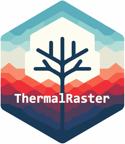

# ThermalRaster

## Package description

**ThermalRaster** package is designed to enhance the processing and analysis of FLIR thermal images. It offers a comprehensive suite of functions for extracting, processing, and visualizing **thermal data** embedded within the metadata of FLIR images. Key features also include retrieving full and cropped **RGB images**. Imagery is returned as **SpatRaster** objects compatible with the **terra** package, enabling to profit from this package features/toolkit. Using RGB images, it is possible to generate synthetic/predicted thermal images for the cropped or full RGB images. The package also enables the handling of JSON annotations/masks from Roboflow (<https://roboflow.com>), enabling the extraction of ROIs from the images for further analysis, making possible to assess, analyze and model fine-scale thermal variation in micro-habitats (i.e., TReMs - Tree Related Micro-habitats). Roboflow's advantages include automating ROI digitization using manual or the SAM (Facebook's Segment Anything) algorithm. ROI's can also be generated with the terra package as SpatVector objects. EXIFtool (<https://exiftool.org/>) is broadly used for retrieving metadata from FLIR imagery.

------------------------------------------------------------------------
